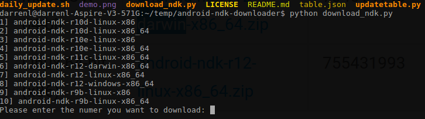

# What's different?
In this fork I made the `download_ndk.py` script compatible with Python 3.x, while maintaining backwards compatibility with Python 2.x.

# NDK Downlaoder

### Purpose
Download NDK versions using python scripts

### Download from web
[Web](http://tzutalin.github.io/android-ndk-downloader/)

### Command line usage
```sh
$ git clone https://github.com/JDFind/android-ndk-downloader.git
$ python download_ndk.py
```


